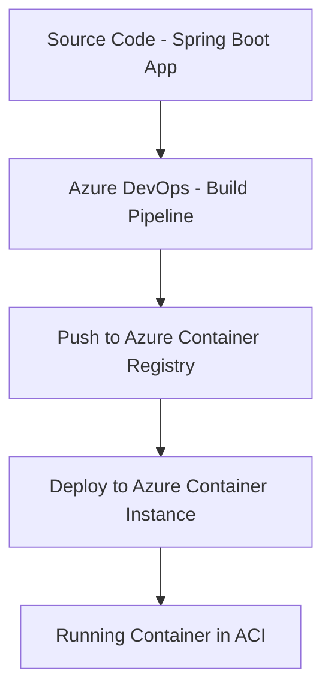

# 🌐 Azure Spring Boot CI/CD Pipeline – Internship Project

This project demonstrates a complete DevOps pipeline for deploying a Spring Boot application using **Azure Container Registry (ACR)** and **Azure Container Instances (ACI)** with **Azure DevOps CI/CD pipelines**.

Developed during my internship at **Celebal Technologies**, this project showcases hands-on application of DevOps principles on Microsoft Azure.

---

## 🚀 Features

- 🐳 Dockerized Spring Boot application
- 📦 Build and push Docker image to Azure Container Registry
- ☁️ Deploy container image to Azure Container Instance via CI/CD pipeline
- ✅ Azure DevOps Service Connections integration
- 🔐 Secrets managed securely using Azure DevOps Library

---

## 🧱 Project Architecture



---

## 🔧 Technologies Used

- **Java 17** with Spring Boot
- **Docker**
- **Azure DevOps Pipelines**
- **Azure Container Registry**
- **Azure Container Instances**
- **YAML Pipeline Configuration**
- **Git + GitHub**

---

## 📁 Folder Structure

```
springboot-azure-cicd/
├── Dockerfile
├── azure-pipelines.yml
├── src/
├── build.gradle / pom.xml
└── README.md
```

---

## 🔄 CI/CD Pipeline

### 🔨 Build Stage
- Maven builds the Spring Boot application
- Docker image is built and tagged as `latest`
- Image is pushed to Azure Container Registry

### 🚀 Deploy Stage
- Azure CLI creates or updates an ACI instance
- Uses the pushed Docker image from ACR
- App is deployed and exposed on port `8080`

---

## 🧪 Testing

Once deployed, you can test the app using:

```bash
curl http://<your-dns-label>.<region>.azurecontainer.io:8080/
```

Or open it in your browser to verify the response.

---

## 🔐 Azure DevOps Service Connections

- ✅ **Docker Registry Connection**: `hjainspringbootacr-connection`
- ✅ **Azure Resource Manager Connection**: `hjain-azure-connection`

---

## 🏁 How to Run This Project

### Prerequisites

- Azure Subscription
- Azure DevOps Account
- ACR and Resource Group created (`springboot-rg`)
- Docker installed locally (for testing)

### Step-by-Step

1. **Clone the repository**

```bash
git clone https://github.com/Harshjain81/springboot-azure-cicd.git
cd springboot-azure-cicd
```

2. **Commit your changes**

```bash
git add .
git commit -m "Init Spring Boot Azure pipeline project"
git push origin master
```

3. **Create Azure DevOps Pipeline**

- Go to Azure DevOps > Pipelines > New Pipeline
- Use existing YAML file: `azure-pipelines.yml`

4. **Create Service Connections**

- **ACR**: Use the Docker Registry type
- **Azure**: Use the Azure Resource Manager type

5. **Run the pipeline**

- Trigger the pipeline manually or via a push

---

## 📝 Deployment YAML Snippet

```yaml
- task: Docker@2
  inputs:
    containerRegistry: 'hjainspringbootacr-connection'
    repository: 'azure-springboot-demo'
    command: 'buildAndPush'
    Dockerfile: '**/Dockerfile'
    tags: |
      latest
```

---

## 📦 Final Output

Access your deployed Spring Boot App via:

```
http://hjainbootdemo.eastus.azurecontainer.io:8080/
```

---

## 👨‍💻 Intern Project - Celebal Technologies

This project was completed during my **DevOps Internship at Celebal Technologies**, where I learned:

- Azure CI/CD pipelines
- Docker and ACR integration
- Real-world DevOps delivery using Infrastructure as Code
- End-to-end deployment of containerized Java applications

---

## 🙌 Special Thanks To

- **Mentors** at Celebal Technologies
- Azure DevOps Documentation & Community
- LinkedIn & GitHub Tech Community

---

## 📬 Contact

- 💼 [LinkedIn](https://www.linkedin.com/in/harshjain81)
- 📧 Email: hjain4432@gmail.com
- 🌐 GitHub: [Harshjain81](https://github.com/Harshjain81)

---

> 💡 _This project is a stepping stone toward becoming a DevOps engineer and building cloud-native solutions._
